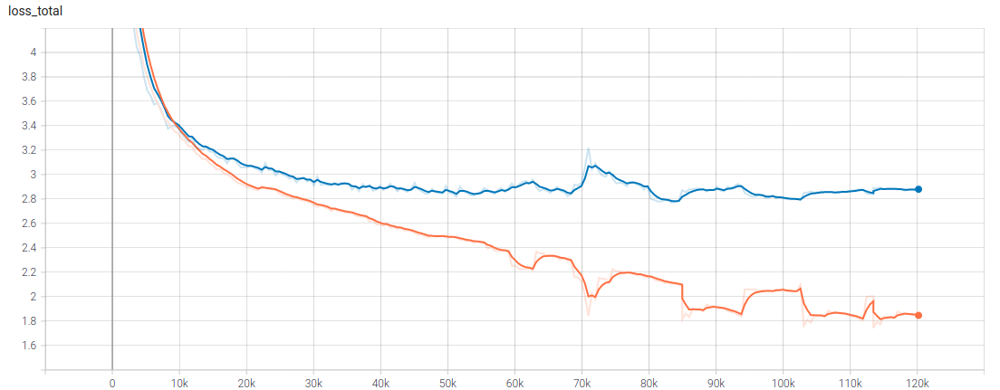

# Cài đặt SSD

Implement SSD model sử dụng PyTorch framework, dựa trên:
- Paper [SSD: Single Shot MultiBox Detector](https://arxiv.org/abs/1512.02325) - Wei Liu, Dragomir Anguelov, Dumitru Erhan, Christian Szegedy, Scott Reed, Cheng-Yang Fu, Alexander C. Berg
- [sgrvinod/a-PyTorch-Tutorial-to-Object-Detection](https://github.com/sgrvinod/a-PyTorch-Tutorial-to-Object-Detection?fbclid=IwAR0D1hBpFYgMZwwlrIwyRxt3aDbCm9kRk3HnCF1AB719IpjBk8bzBjkMqow)
- [ NVIDIA / DeepLearningExamples](https://github.com/NVIDIA/DeepLearningExamples/tree/master/PyTorch/Detection/SSD)

# Result
metrics_mAP: 0.7521743178367615
```
{'aeroplane': 0.791704535484314,
 'bicycle': 0.8258624076843262,
 'bird': 0.7511035799980164,
 'boat': 0.6727907657623291,
 'bottle': 0.4380609393119812,
 'bus': 0.8500802516937256,
 'car': 0.8373016119003296,
 'cat': 0.8786832690238953,
 'chair': 0.5368670225143433,
 'cow': 0.8131552934646606,
 'diningtable': 0.7420586943626404,
 'dog': 0.8541377782821655,
 'horse': 0.8649511337280273,
 'motorbike': 0.827508807182312,
 'person': 0.766398549079895,
 'pottedplant': 0.46190717816352844,
 'sheep': 0.7650071382522583,
 'sofa': 0.7869663238525391,
 'train': 0.8461859822273254,
 'tvmonitor': 0.7327556610107422,
 }
```


